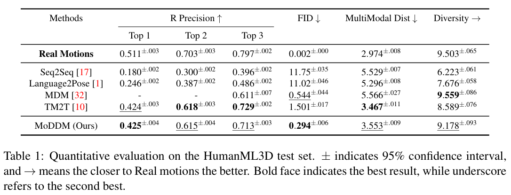
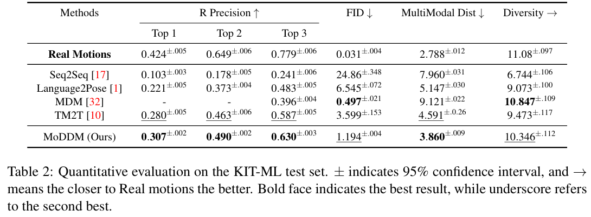
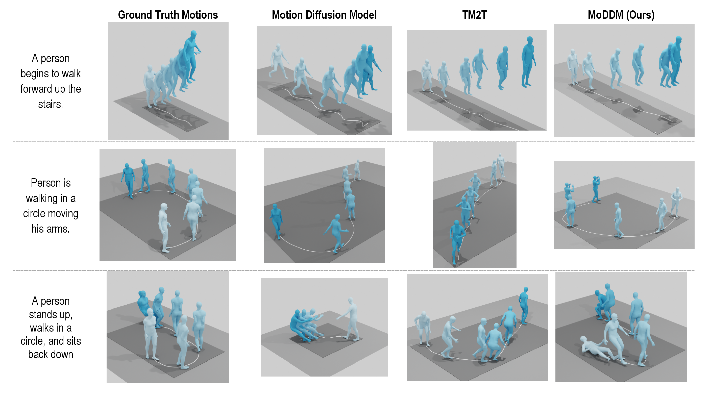

# MoDDM: Text-to-Motion Synthesis using Discrete Diffusion Model (BMVC 2023)
## [[Paper]](https://papers.bmvc2023.org/0624.pdf) [[Poster]](https://bmvc2022.mpi-inf.mpg.de/BMVC2023/0624_poster.pdf) [[Video]](https://bmvc2022.mpi-inf.mpg.de/BMVC2023/0624_video.mp4) [[Supp]](https://bmvc2022.mpi-inf.mpg.de/BMVC2023/0624_supp.zip)


Generating motions based on text descriptions. Analogy to text-to-image that generate new images from text. 

## Instructions to setup

```bash
conda create -n text2motion python=3.9
conda activate text2motion
# Clone repository recursively
git clone https://github.com/Developer-Zer0/MoDDM-Text-to-Motion-Synthesis-Using-Discrete-Diffusion.git --recurse-submodules
# Install Pytorch 1.10.0 (**CUDA 11.1**)
pip install torch==1.10.0+cu111 torchvision==0.11.0+cu111 torchaudio==0.10.0 -f https://download.pytorch.org/whl/torch_stable.html
# Install required pacakges
pip install -r requirements.txt
# Install DetUtil 
cd DetUtil
python setup.py develop
```

## Perform single sample inference
API to run single sample inference using trained model on HumanML3D. Edit `sample_description.txt` to any text description of your choice. Inference **does not require GPU** and runs completely on CPU within 15 seconds. First run can take additional time to load CLIP.

1) You need to setup FFMPEG for .mp4 generation. Follow instructions at <a href='https://www.ffmpeg.org/download.html'>LINK</a>. After installation, add path to ffmpeg.exe (inside bin folder) in .env (Rename .env.example).

2) Download <a href='https://drive.google.com/file/d/1al0yAaOyUVx959W6hiyWyGVsDTq-rOJ3/view?usp=sharing'>autoencoder checkpoint</a> and <a href='https://drive.google.com/file/d/15igbR5bfv3E-fv1nKDd0pl1w7_41ZrOr/view?usp=sharing'>discrete diffusion checkpoint</a>. Store them under `checkpoints/` (Create if doesn't exist).

3) You will also need to download <a href='https://drive.google.com/file/d/1bzD_qzqwv4T5SKMKk7VvbzvXu61ee86H/view?usp=sharing'>SMPL_DATA</a> and <a href='https://drive.google.com/file/d/1wmmyIyBYegYQCh-MTbvrVZfnobgcMbTt/view?usp=sharing'>Deps</a> for the human skeleton transformations and animations. Extract them and store under `data/` (Create if doesn't exist) (`data/Deps`, `data/SMPL_DATA`).

4) Run the following script and your human motion .mp4 will be stored in `generations/`.

```bash
python sample_generation.py
```

## Dataset
To get both HumanML3D and KIT-ML dataset, follow instructions at https://github.com/EricGuo5513/HumanML3D. Once downloaded, store at location `data/` (Create if doesn't exist). For training and evaluations, you will also need SMPL_DATA and Deps from Step 3 of single sample inference.
Default dataset will be the HumanML3D dataset in all experiments. To use the KIT dataset add `datamodule=guo-kit-ml.yaml` as a parameter in command scripts.

## Train Stage 1 Vector Quantized Variational AutoEncoder (VQ-VAE)

*You can skip this step by using an autoencoder checkpoint. If you want to skip, copy paste `autoencoder_finest.ckpt` in the same location and rename is to `autoencoder_trained.ckpt`.*

Train VQ-VAE reconstruction model on HumanML3D (or KIT-ML). Run the following script. All the outputs and checkpoints will be stored in `logs/`.

```bash
 python src/train.py --config-name=train model=vq_vae.yaml model.do_evaluation=false trainer.devices=[1] trainer.max_epochs=500
 ```

Setting `model.do_evaluation=True` will run the evaluator after every epoch to store FID, R-Precision. However, evaluator is a pre-trained model by the work at https://github.com/EricGuo5513/TM2T. You will need to download the pre-trained models from <a href='https://drive.google.com/file/d/1OXy2FBhXrswT6zE4SBSPpVfQhxmI8Zzy/view'>LINK</a>. For HumanML3D evaluator, you need the `t2m/text_mot_match/model/finest.tar`. Store it at `checkpoints/t2m/text_mot_match/model/finest.tar`.

KIT-ML pre-trained models are from the above work as well and can be found at <a href='https://drive.google.com/file/d/1ied_KWvqXXsP2Gls-SvzjXIZtHHZ5zpi/view'>LINK</a>. For the KIT-ML evaluator, you need the `kit/text_mot_match/model/finest.tar`. Store is at `checkpoints/kit/text_mot_match/model/finest.tar`. Also include `eval_ckpt=checkpoints/kit/text_mot_match/model/finest.tar` as parameter in script.

## Train Stage 2 Discrete Diffusion Model

Discrete Diffusion training on HumanML3D (or KIT-ML). Copy trained autoencoder checkpoint from above step and paste directly into `checkpoints/`. Rename .ckpt file to `autoencoder_trained.ckpt` so that stage 2 can load it. All the outputs and checkpoints will be stored in `logs/`. 3 checkpoints will be created corresponding to the epoch with best validation FID, best validation R-Precision and best validation loss. Run the following command.

```bash
 python src/train.py --config-name=train model=vq_diffusion.yaml model.do_evaluation=false trainer.devices=[1] trainer.max_epochs=500
 ```

Similar to stage 1 training, setting `model.do_evaluation=True` will run the evaluator after every epoch to store metrics. Follow above steps to download pre-trained models for HumanML3D (or KIT-ML)

Set `logger=tensorboard` to get loss and metric plots across epochs.

## Benchmark Results

We compare our model to 4 methods: <a href='https://www.cs.utexas.edu/~huangqx/NeurIPS_ViGIL_Text2Animation.pdf'>Seq2Seq</a>, <a href='https://arxiv.org/abs/1907.01108'>Language2Pose</a>, <a href='https://arxiv.org/abs/2207.01696'>TM2T</a> and <a href='https://arxiv.org/abs/2209.14916'>Motion Diffusion Model (MDM)</a>. Seq2seq and Language2Pose are
deterministic motion generation baselines. TM2T utilizes VQ-VAE and recurrent models for text-to-motion synthesis task. MDM uses a conditional diffusion model on raw motions that showed promising motion results.

HumanML3D                  |  KIT-ML
:-------------------------:|:-------------------------:
  |  



## Synthesized Motions

